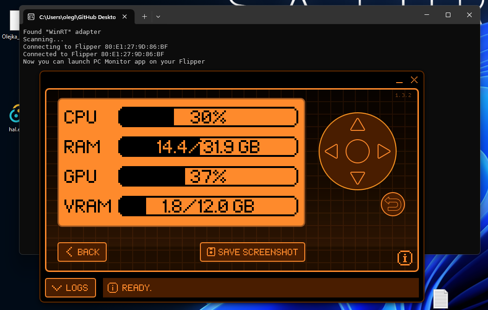

# flipper-pc-monitor-backend
Backend for flipper-pc-monitor written in Rust

**[This backend is for PC Monitor app](https://github.com/TheSainEyereg/flipper-pc-monitor)**  
Please note that GPU info is only displayed on Nvidia cards

### ⚠️ For Linux users:
If you receive the `Failed to connect to Flipper: Service discovery timed out`, then you need manually run `bluetoothctl` and pair your flipper to your PC.
1. Run `bluetoothctl`
2. Enable scanning: `scan on`
3. Pair to device starting with `PC Mon`: `pair <MAC address>`
4. Enter pin code that was shown on the Flipper

## Screenshots

